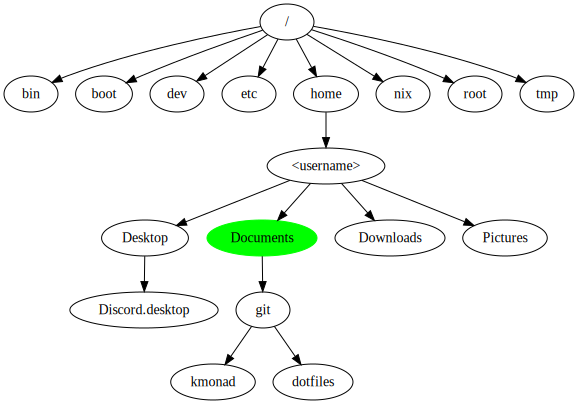
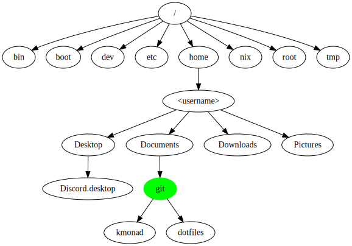
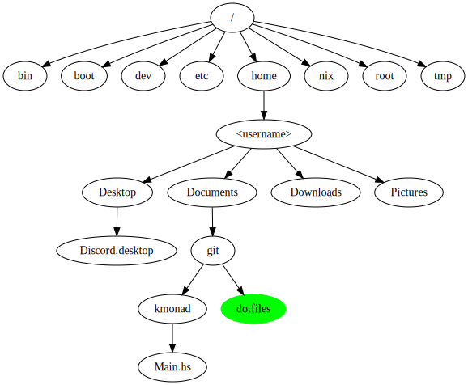

# The file system

---
Consists primarily of:

- Directories
- Files

---

## Tree

File system in linux:

---

## Terminal commands

- pwd (print working directory)
- cd (change directory)
- ls (list directory contents)
- mkdir (make directory)
- rmdir (remove directory)
- touch (create file)
- rm (remove file)

---

## Example

---

Relative path works because git is in the directory we are standing in
- \> cd git

Absolute path works from anywhere
- \> cd /home/\<username\>/Documents/git
- \> cd ~/Documents/git

---
## Example

---

## Common error

Being in the wrong directory

---

---

\> ghci
\> :l Main.hs

`error: Can't find Main.hs`

---

## Solution

Either
- Move to the correct directory `cd ../kmonad`
- Give correct relative/absolute path

In ghci:
Relative path: `:l ../kmonad/Main.hs`
Absolute path: `:l ~/Documents/git/kmonad/Main.hs`

---
## Tips

* "~" expands to /home/<username>
* "cd -" to switch between last two visited directories
* "ls -a" show hidden files (files starting with a dot, e.g .gitignore)
* "cd" without arguments to move to home directory
* "cp" copy a file
* "mv" move a file