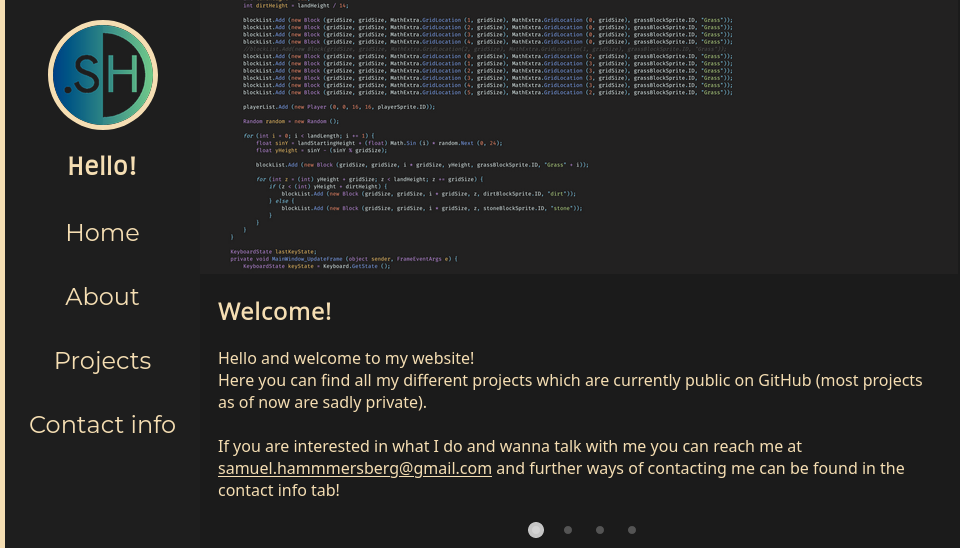
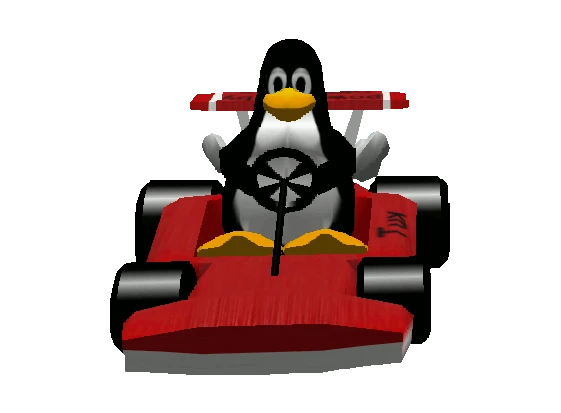

# Cool Stuff to do to Learn Programming 
### (CSTDTLP)

---

# Gör en Portfolio Sida!

    <ul>
        <li>Skoj sätt att visa vad man kan</li>
        <li>Bra sätt att lära sig t.ex HTML och CSS</li>
    </ul>
    

        
    

---

# Advent of Code (AoC)

    <ul>
        <li>25 årliga utmaningar</li>
        <li>Finns 7 år av samlade uppgifter</li>
        <li>Släpper nya uppgifter varje December</li>
        <li>Svårighetsgraden går från väldigt  
            lätt till svårt!</li>
        <li>Vi på DV har en leaderboard där vi  
            svättas om första platsen</li>
    </ul>
    

        <h3>Link:</h3>
        
    

---

# Testa Linux

    <ul>
        <li>Nyttigt att kunna!</li>
        <li>Testa i en Virtual Machine eller WSL  
            om du inte vill installera!
        </li>
        <li>Ni kan spela Tux Kart!</li>
    </ul>
    

        
    

---

# Frågor frågor frågor

* #### Vad är Docker?
  Docker är ett verktyg för att låsa in applikationer i små "lådor"
  Stoppar dom från att röra resten av systemet

* #### I vilka situationer blir det mergekonflikter i Git?
  När två eller flera personer redigerar samma fil samtidigt

---

* #### Varför är Linux så bra om om Torvalds använder en MacBook?
  Torvalds använder Linux på sin MacBook :)

* #### I vilket stjärntecken är Torvalds född i?
    Torvalds är en Stenbock!

---

# Andra frågor?
### Kör på!